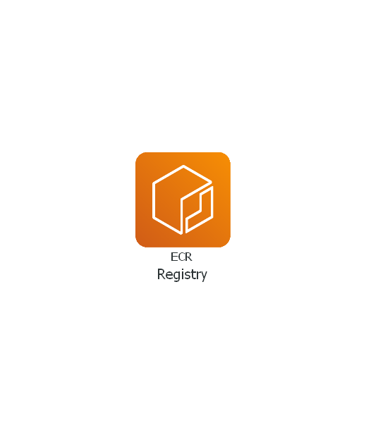

# terraform-aws-ecrpublic

[](https://github.com/JamesWoolfenden/terraform-aws-ecrpublic)
[](https://github.com/JamesWoolfenden/terraform-aws-ecrpublic/releases/latest)
[](https://github.com/JamesWoolfenden/terraform-aws-ecrpublic/releases/latest)

[](https://www.bridgecrew.cloud/link/badge?vcs=github&fullRepo=JamesWoolfenden%2Fterraform-aws-ecrpublic&benchmark=CIS+AWS+V1.2)
[](https://github.com/pre-commit/pre-commit)
[](https://www.checkov.io/)
[](https://www.bridgecrew.cloud/link/badge?vcs=github&fullRepo=JamesWoolfenden%2Fterraform-aws-ecrpublic&benchmark=INFRASTRUCTURE+SECURITY)

---

Terraform module to provision an AWS [`Elastic Container Registry`](https://aws.amazon.com/ecr/)

This registry is immutable, so you cannot push the "latest" container twice.

It's 100% Open Source and licensed under the [APACHE2](LICENSE).



## Usage

Include this repository as a module in your existing Terraform code:

```terraform
module "ecr" {
  source           = "github.com/JamesWoolfenden/terraform-aws-ecrpublic"
  version          = "v0.1.1"
  name             = var.name
}
```

### Logging-in to ECR

Retrieve an authentication token and authenticate your Docker client to your registry.

### Use the AWS and Docker CLI

```cli
aws ecr-public get-login-password --region us-east-1 | docker login --username AWS --password-stdin public.ecr.aws/xxxxxxx
```

You can skip this step if your image is already built:

```cli
docker build -t node-terraform .
```

Now build your Dockerfile

```shell
$docker build .
$docker images                               ✔ │ 4s │ 11:41:46 
REPOSITORY   TAG       IMAGE ID       CREATED         SIZE
<none>       <none>    bb8a493bc0a0   24 months ago   4MB
```

Then tag the image:

```shell
docker tag node-terraform:latest public.ecr.aws/xxxxxxx/node-terraform:latest
```

Run the following command to push this image to your newly created AWS repository:

```cli
docker push public.ecr.aws/xxxxxxx/node-terraform:latest
```

<!-- BEGINNING OF PRE-COMMIT-TERRAFORM DOCS HOOK -->
## Requirements

No requirements.

## Providers

| Name | Version |
|------|---------|
| <a name="provider_aws"></a> [aws](#provider\_aws) | n/a |

## Modules

No modules.

## Resources

| Name | Type |
|------|------|
| [aws_ecrpublic_repository.repository](https://registry.terraform.io/providers/hashicorp/aws/latest/docs/resources/ecrpublic_repository) | resource |

## Inputs

| Name | Description | Type | Default | Required |
|------|-------------|------|---------|:--------:|
| <a name="input_about"></a> [about](#input\_about) | n/a | `string` | `"About text"` | no |
| <a name="input_architectures"></a> [architectures](#input\_architectures) | n/a | `list(string)` | <pre>[<br>  "Linux"<br>]</pre> | no |
| <a name="input_common_tags"></a> [common\_tags](#input\_common\_tags) | Implements the common tags scheme | `map(any)` | n/a | yes |
| <a name="input_description"></a> [description](#input\_description) | n/a | `string` | `"Description"` | no |
| <a name="input_image"></a> [image](#input\_image) | n/a | `string` | `""` | no |
| <a name="input_name"></a> [name](#input\_name) | The name of the registry | `string` | n/a | yes |
| <a name="input_operating_systems"></a> [operating\_systems](#input\_operating\_systems) | n/a | `list(string)` | <pre>[<br>  "x86-64"<br>]</pre> | no |
| <a name="input_usage_text"></a> [usage\_text](#input\_usage\_text) | n/a | `string` | `"Usage Text"` | no |

## Outputs

| Name | Description |
|------|-------------|
| <a name="output_ecr"></a> [ecr](#output\_ecr) | The full details of the repo |
| <a name="output_ecr_arn"></a> [ecr\_arn](#output\_ecr\_arn) | The Amazon resource name for the repository |
| <a name="output_ecr_repo_name"></a> [ecr\_repo\_name](#output\_ecr\_repo\_name) | The name of the repository |
| <a name="output_ecr_repository_uri"></a> [ecr\_repository\_uri](#output\_ecr\_repository\_uri) | The URL of your new registry |
<!-- END OF PRE-COMMIT-TERRAFORM DOCS HOOK -->

## Information

A terraform module to create a container registry (ECR - Elastic Container Registry) in AWS.
There are two policies attached, a life-cycle policy which details how to look after the containers and a permission policy which has a default allow allusers in the account.
I use this to store the customised containers I use in Codebuild and for storing containers for Fargate.

## Related Projects

Check out these related projects.

- [terraform-aws-codebuild](https://github.com/jameswoolfenden/terraform-aws-codebuild) - Making a Build pipeline

## Help

**Got a question?**

File a GitHub [issue](https://github.com/jameswoolfenden/terraform-aws-ecrpublic/issues).

## Contributing

### Bug Reports & Feature Requests

Please use the [issue tracker](https://github.com/jameswoolfenden/terraform-aws-ecrpublic/issues) to report any bugs or file feature requests.

## Copyrights

Copyright © 2019-2022 James Woolfenden

## License

[](https://opensource.org/licenses/Apache-2.0)

See [LICENSE](LICENSE) for full details.

Licensed to the Apache Software Foundation (ASF) under one
or more contributor license agreements. See the NOTICE file
distributed with this work for additional information
regarding copyright ownership. The ASF licenses this file
to you under the Apache License, Version 2.0 (the
"License"); you may not use this file except in compliance
with the License. You may obtain a copy of the License at

<https://www.apache.org/licenses/LICENSE-2.0>

Unless required by applicable law or agreed to in writing,
software distributed under the License is distributed on an
"AS IS" BASIS, WITHOUT WARRANTIES OR CONDITIONS OF ANY
KIND, either express or implied. See the License for the
specific language governing permissions and limitations
under the License.

### Contributors

[![James Woolfenden][jameswoolfenden_avatar]][jameswoolfenden_homepage]<br/>[James Woolfenden][jameswoolfenden_homepage]

[jameswoolfenden_homepage]: https://github.com/jameswoolfenden
[jameswoolfenden_avatar]: https://github.com/jameswoolfenden.png?size=150
[github]: https://github.com/jameswoolfenden
[linkedin]: https://www.linkedin.com/in/jameswoolfenden/
[twitter]: https://twitter.com/JimWoolfenden
[share_twitter]: https://twitter.com/intent/tweet/?text=terraform-aws-ecrpublic&url=https://github.com/jameswoolfenden/terraform-aws-ecrpublic
[share_linkedin]: https://www.linkedin.com/shareArticle?mini=true&title=terraform-aws-ecrpublic&url=https://github.com/jameswoolfenden/terraform-aws-ecrpublic
[share_reddit]: https://reddit.com/submit/?url=https://github.com/jameswoolfenden/terraform-aws-ecrpublic
[share_facebook]: https://facebook.com/sharer/sharer.php?u=https://github.com/jameswoolfenden/terraform-aws-ecrpublic
[share_email]: mailto:?subject=terraform-aws-ecrpublic&body=https://github.com/jameswoolfenden/terraform-aws-ecrpublic
